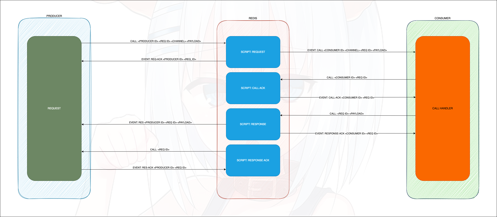

# origami

**Origami** - это протокол для гарантированного получения запроса/ответа. 
Это достигается за счет подтверждения получения данных от другой стороны и повторной отправки неполученных данных.

## Предистория

Для реализации модели общения между сервисов в своих проектах я истользовал NATS, REDIS и голый TCP. 
Они довольно быстродейственные и легки в использовании, но редко бывали случаи когда происходили микро-разрывы 
соединения между сервисами из-за чего терялся либо запрос, либо ответ. Интересно, что сетевой 
сокет при этом не ловил события разрыва соединения, программа считала что соединение все так же активно и 
сокет дольше продолжал использоваться, но вот все сообщения уходили в никуда...
\
\
Может у этого есть термин и это решается какими-нибудь ретраями, но в моих кейсах ретраи не подходят. И уже написанные 
библиотеки не включали в себя механизмов проверки соединения.

## Краткое описание

Протокол **Origami** использует **Redis** для отправки запросов и получения событий.
\
\
Реализация включает в себя 3 активных подключения к **Redis**

- **Ping Connection** - используется исключитель для отправки запросов на вызов скиптов `init` и `ping`
- **Listener Connection** - используется для подписки на события и только их и слушает
- **Publisher Connection** - используется для отправки запров (__игнорирует ответы__)

### Подключение клиента

При старте клиент генерирует себе уникальный идентификатор (**UUIDv4**), инициирует пул подключений к **Redis**.
После иниализации подключений отправляется запрос на вызов скрипта `init` в котором передается идентификатор 
клиента и массив каналов в которых он хочет случать запросы

### Отправка запроса

Для удобство введем понятия:
- **Producer** (__продюсер__) - тот кто отправляет запрос
- **Consumer** (__консюмер__) - тот кто обрабатывает запрос

Для каждой стороны есть свои скрипты исполнения:
- (**Producer**)`request` который выбирает получателя из доступного пула хранящегося в **Redis** 
после выбора получателя (__консюмер__) и отправляет ему события типа `call`, 
__продюсеру__ отправляется событие типа `request-ack`, которое подтверждает, что запрос 
был принят и обработан в **Redis**
- (**Consumer**)`call-ack` который должен вызвать __консюмер__ после получения события типа `call` и 
дождаться обратного события типа `call-ack` чтобы убедиться что данный запрос уже точно 
закреплен за ним и не будет перераспределен другому
- (**Consumer**)`response` который вызывается после исполнения __консюмером__ запроса, скрипт 
отправляет собитие типа `response` __продюсеру__ c результатом обработки, и отправляет 
событие типа `response-ack` __консюмеру__ чтобы подтвердить получение ответа в **Redis**
- (**Producer**)`response-ack` вызывается __продюсером__ чтобы подтвердить получение ответа, отправляет 
__продюсеру__ событие типа `response-ack`


_Origami Tobiichi. Одной из черт ее характера является настойчивость._

### Проверка соединения

Соединение проверятся в пассивном режиме.
\
\
Клиент каждую секунду отправляет через **Ping Connection** запрос 
на вызов скрипта `ping` и ждем пока ему от **Listener Connection** 
придет событие что пинг был получени. Если в течении секунды после отправки 
событие не приходит, то это считается неожиданным разрывом соединения и 
все текущие соединения разрывается и подключаются заного.
\
\
После восстановления соединения, производиться попытка повторной 
отправки всех повисших запросов. Все запросы помечены уникальным 
идентификатором, поэтому дублирования бояться не стоит

### Типы сообщений

- `origami.a` - ответ __продюсеру__ на вызов скрипта `ping`
  ```
  ПОДПИСКА:
  origami.ac64e9eb3-0295-4506-8d69-86e56b8ecf6f
  
  "origami."                             - 8 символов          — название пакета
  "a"                                    - 1 символ            — тип сообщения
  "c64e9eb3-0295-4506-8d69-86e56b8ecf6f" - 36 символов         — ID клиента
  
  
  СООБЩЕНИЕ:
  1
  
  сообщение всегда одинаковое
  ```
- `origami.b` - уведомление __консюмера__ о новом запросе
  ```
  ПОДПИСКА:
  origami.b98206706-632c-469b-9064-39ae8a4610b4channel_subchannel
  
  "origami."                             - 8 символов          — название пакета
  "b"                                    - 1 символ            — тип сообщения
  "98206706-632c-469b-9064-39ae8a4610b4" - 36 символов         — ID клиента
  "channel_subchannel"                   - имя канала          — начинается после ID клиента и до конча имени подписки
  
  
  СООБЩЕНИЕ:
  6ba04b7c-705f-4f86-9d77-a822d11acdb16a39ba8a-0400-4d55-b13e-a99b0e966bab{"param":"value"}

  "6ba04b7c-705f-4f86-9d77-a822d11acdb1" - 36 символов         — ID запроса
  "6a39ba8a-0400-4d55-b13e-a99b0e966bab" - 36 символов         — ID инициатора запроса
  "{"param":"value"}"                    - параметры запроса   — начинается после ID запроса и до конца сообщения
  ```
- `origami.c` - уведомление __продюсера__ о том, что запрос был успешно зарегистрирован
  ```
  ПОДПИСКА:
  origami.c7769f601-419c-4293-9c4b-fbd6e1d90fd5
  
  "origami."                             - 8 символов          — название пакета
  "c"                                    - 1 символ            — тип сообщения
  "7769f601-419c-4293-9c4b-fbd6e1d90fd5" - 36 символов         — ID клиента
  
  
  СООБЩЕНИЕ:
  1eb8b7de-b5ed-45be-8c6f-86c7c435178b
  
  "1eb8b7de-b5ed-45be-8c6f-86c7c435178b" - 36 символов — ID запроса
  ```
- `origami.d` - ответ __консюмеру__ на вызов скрипта `request_ack`, уведомляет о том, что запрос был успешно принят __консюмером__
  ```
  ПОДПИСКА:
  origami.d83a6bce5-11ca-457b-8b2b-be6630667141
  
  "origami."                             - 8 символов          — название пакета
  "d"                                    - 1 символ            — тип сообщения
  "83a6bce5-11ca-457b-8b2b-be6630667141" - 36 символов         — ID клиента
  
  
  СООБЩЕНИЕ:
  1e996de9d-0d37-47e2-abe6-476f5b708e7b
  
  "1"                                    - 1 символ            — успех (1) или неуспех (0) 
  "e996de9d-0d37-47e2-abe6-476f5b708e7b" - 36 символов         — ID запроса
  ```
- `origami.e` - уведомление о получении ответа на запрос от __консюмера__ __продюсеру__
  ```
  ПОДПИСКА:
  origami.ef6c68e02-5d84-40f2-8e4d-cf867b43bf7f
  
  "origami." - 8 символов — название пакета
  "e" - 1 символ — тип сообщения
  "f6c68e02-5d84-40f2-8e4d-cf867b43bf7f" - 36 символов — id клиента
  
  
  СООБЩЕНИЕ:
  0a9e8aa79-653e-4898-92b4-2543b29cfaaf{"response":"value"}
  
  "0"                                    - 1 символ            — признак успешности запроса (0 - успех; 1 - неожиданная ошибка; 2 - ошибка таймаута)
  "a9e8aa79-653e-4898-92b4-2543b29cfaaf" - 36 символов         — ID запроса
  "{"response":"value"}"                 - ответ (или ошибка)  — начинается после ID запроса и до конца сообщения
  ```
- `origami.f` - ответ __продюсеру__ на вызов скрипта `response_ack`, уведомляет о том, что ответ на запрос был успешно принят __продюсером__
  ```
  ПОДПИСКА:
  origami.f38384f6d-6060-4ea4-b3e4-864a7efcbb31
  
  "origami."                             - 8 символов          — название пакета
  "f"                                    - 1 символ            — тип сообщения
  "38384f6d-6060-4ea4-b3e4-864a7efcbb31" - 36 символов         — ID клиента
  
  
  СООБЩЕНИЕ:
  c30c8772-aaa4-4ea2-8bda-72e67e851fd6
  
  "c30c8772-aaa4-4ea2-8bda-72e67e851fd6" - 36 символов         — ID запроса
  ```
- `origami.g` - уведомляет __консюмера__ о том, что ответ на запрос был успешно зарегистрирован
  ```
  ПОДПИСКА:
  origami.g3d854494-e776-45ad-96fe-0ef76f4d0426
  
  "origami."                             - 8 символов          — название пакета
  "g"                                    - 1 символ            — тип сообщения
  "3d854494-e776-45ad-96fe-0ef76f4d0426" - 36 символов         — ID клиента
  
  
  СООБЩЕНИЕ:
  30734bba-4401-4685-866f-f1563fa54a67
  
  "30734bba-4401-4685-866f-f1563fa54a67" - 36 символов         — ID запроса
  ```
- `origami.h` - ответ на вызов скрипта `stop`, уведомляет о том, что клиенту болеше не будут приходить запросы
  ```
  ПОДПИСКА:
  origami.h244adaa8-7b2c-462c-8ac5-ba2eca95fcc3
  
  "origami."                             - 8 символов          — название пакета
  "h"                                    - 1 символ            — тип сообщения
  "244adaa8-7b2c-462c-8ac5-ba2eca95fcc3" - 36 символов         — ID клиента
  
  
  СООБЩЕНИЕ:
  1
  
  "1"                                    - 1 символов          — ответ всегда статичен
  ```
